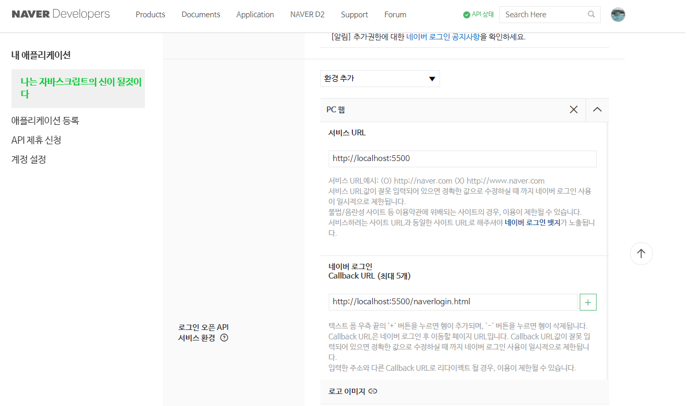
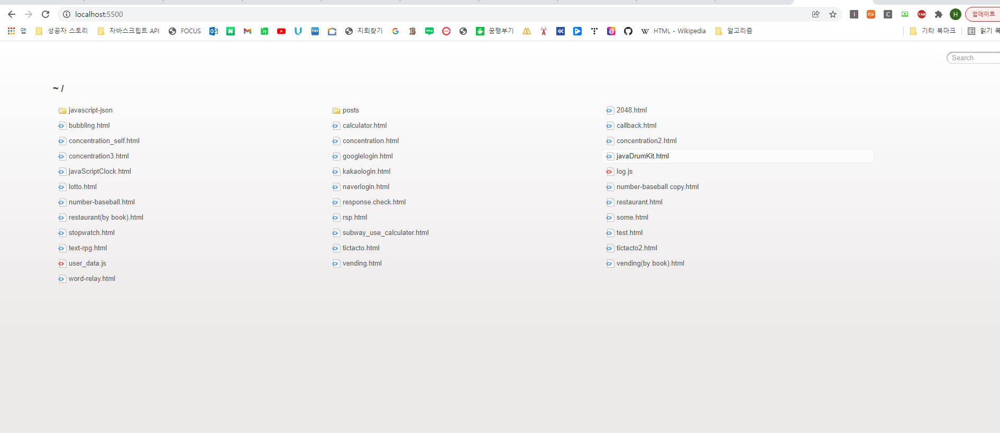
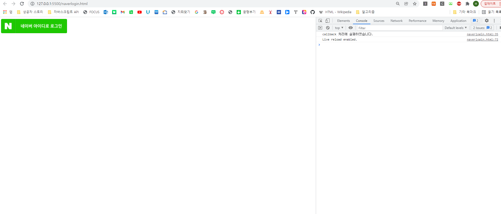

# 2. 네이버 로그인 API 실행 시 "callback 처리에 실패하였습니다." 발생 이유

    우리는 아래의 사진과 같이 네이버 로그인 API를 사용하기 위해 
    [https://developers.naver.com/](https://developers.naver.com/)에서 API설정을 한다. 

    나의 서비스URL이 http://localhost:5500 이라는 것이다. 
    그냥 서비스 URL이라고 하면 서비스를 제공해주는 URL이라는 건 알겠지만 이해는 잘 안간다. 
    결과적으로 내가 이번 공부를 통해 배운 것은 위의 말도 맞다. 
    하지만 위의 http://localhost:5500를 통해서 API를 접속하지 않으면 접속이 안된다는 말과도 같다.무조건 웹에서 저 서비스 URL로만 
    네이버 로그인 API가 사용가능 하다는 거다.

    예를 들어 나 같은 경우는 로그인 API코드를 비주얼 스튜디오에 치고 open with live server로 새로운 크롬창을 생성하여
    로그인 API를 사용하려고 했다. 
    근데 , 계속 콘솔에 위의 오류와 같이 "callback 처리에 실패하였습니다." 만 떴다. 
    도대체 오류의 이유를 몰랐다. 코드도 올바르게 쳤고, clientID도 제대로 쳤고, API설정 창에도 제대로 localhost:5500로 적었는데 
    왜 실행이 안되지?
    네이버 개발자 포럼에 가서 이유를 검색하고 구글에 검색을 해도 내가 원하는 답을 찾지는 못했다.

    그러다 오늘 다시 카카오톡 로그인 API를 연습하다 알게 되었다. 
    URI를 적는 곳에 http://localhost:5500를 치면 현재 비주얼스튜디오에 생성한 파일들을 나타내는 창이 뜬다. 

    이 창에서 파일을 클릭하면 내가 html로 작성한 파일을 렌더링한 페이지가 나타난다. 
    호기심으로 여기에 있는 naverlogin.html을 클릭하니 내가 원하는 대로 네이버 로그인 API 코드가 렌더링 되어 나타났다.
    즉, 이 localhost:5500에서만 네이버 로그인 API가 사용 가능하다는 거다. 

    하지만, 비주얼 스튜디오에서 open with live server로 새로운 크롬창을 생성하여 로그인 API를 렌더링하려고 하면 아래의 사진과 같이
    URI에 127.0.0.1:5500로 뜬다.
 

    127.0.0.1은 localhost의 IP주소 인데, 뭐가 문제지? 가 이제 나의 의문점이다. 
    그에 관련한 정답을 아래의 참조로 조금 이해가 된거 같긴 하지만 완벽하게는 아니다. 

참조: velog.io/@lky9303님 [127.0.0.1 과 localhost의 차이](https://velog.io/@lky9303/127.0.0.1-%EA%B3%BC-localhost%EC%9D%98-%EC%B0%A8%EC%9D%B4)
     
     결론적으로 localhost는 사람이 쉽게 외우는 도메인 네임이고, 127.0.0.1(localhost의 ip)은 실제 우리가 접속하는 ip의 주소이다.
     (추가적으로, localhost의 ip주소는 운영체제의 설정파일인 host의 설정에 따라 127.0.0.1가 아니라 다른 127.0.0.1로 redirect 될 수도 있다고 한다.)
     그러나 내 설정파일을 보지는 않았지만 왠지 그런이유로 비주얼스튜디오에서 open with live server로 실행이 되지 않는 것은 아닌거 같다
     고로 localhost === 127.0.0.1 가 같은 말이라는 거다.

     그럼 localhost:5500 === 127.0.0.1:5500도 같은 것이기때문에 아무문제없이 API가 실행되어야 하는거 아닌가?
     왜 비주얼 스튜디오를 통해서 크롬창을 생성하여 API에 접속하려고 할때는 API가 실행이되지 않는걸까?

    외부의 경로로부터 localhost를 접속하였기때문인가?

    그래서 나만의 결론은 네이버 로그인 API에서는  API설정에 등록된 서비스 URL을 통해서만 무조건 로그인 API 을 사용하게 한다는 거다. 
    웹브라우저 URI에 꼭 등록된 서비스 URL을 적고 접속하여 꼭 그 도메인에서만 API를 사용하도록 허용한다. 

+ 왜 127.0.0.1:5500은 안되는지 모르겠지만 다른 경로를 통해 127.0.0.1:5500를 접속하려고 했으니 안되는걸로 일단은 이해하자
