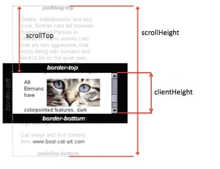

# 바닐라 자바스크립트 By 고승원

> 14장 실습예제 (2)
> 
> 지하철 요금 계산기

## 주목할 함수

##  1. element.insertAdjacentHTML( "beforeend", 추가할 문자열을 포함한 태그)
    + 'beforebegin' element 앞에
    + 'afterbegin' element안에 가장 첫번째 child
    + 'beforeend' element안 가장 마지막 child 
    + 'afterend' element 뒤에
    => text인자(두번째 변수)는 HTML 또는 XML로 해석될 수 있는 문자열이고, 자바스크립트로 html code와 (DOM)tree에 코드를 삽입가능하게 만든다.

##  2. document.getElementById('start').value
    + document.getElementById('start')는 HTML 코드에서 select태그 요소를 반환하는데, 하위태그 option태그의 index 번호를 반환한다.
    + 반환된 value는 타입이 String이다.(숫자 아님)
    + 그래서 아래의 코드에서 parseInt(변수)로 문자열을 숫자로 바꾸어준다.
    + 
    
##  3. Element.scrollTop 속성
    + Element.scrollTop 속성으로 요소의 컨텐츠가 수직으로 스크롤될때의 픽셀의 수를 지정하거나 반환한다.
    + 요소의 scrollTop 속성값은 요소의 컨텐츠 시작으로터 컨텐츠 끝까지의 거리 측정값이다.  예를 들어, 요소의 컨텐츠가 수직 스크롤바를 생성하지 않는다면
     scrollTop의 속성값은 '0'이다.
    + output.scrollTop = output.scrollHeight // 대입

##  4. Element.scrollHeight 속성
    + Element.scrollHeight 속성은 요소컨텐츠의 총 높이를 나타내고, 바깥으로 넘쳐서 보이지 않는 콘텐츠도 포함한다.
    + 즉, output.scrollTop = output.scrollHeight는 변수 output에 담긴 div태그 요소에 textContent가 늘어날때마다 요소컨텐츠의 총 높이도 커진다.
    + 그래서 scollTop속성에 scrollHeight의 값을 대입하면 변해가는 ScrollHeight의 값에따라 아래로 스크롤가능한 스크롤의 값이 커지는 것이다.  
    + 이 내부 높이는 내부 여백을 포함하지만, 수평 스크롤바의 높이 경계선, 외부여백(margin)은 포함하지 않는다.

##  5. Element.clientHeight 속성
    + 읽기 전용 속성인 Element.clientHeight 속성은 요소 내부 높이를 픽셀로 반환한다.
    + 이 내부 높이는 내부 여백을 포함하지만, 수평 스크롤바의 높이 경계선, 외부여백(margin)은 포함하지 않는다.

##  3 ~ 5. 결론

> Element.scrollTop 속성: 이때까지 얼마나 스크롤했는지(스크롤의 위치)
> Element.scrollHeight 속성: 콘텐츠의 총 높이
> Element.clientHeight 속성: 스크롤의 정해진 총 높이(height)

   

## 목표(결과물)
+ 현재 날짜를 지정한 날짜 포맷으로 반환한다.

## 주어진 함수 코드
~~~Java Script
  <iDOCTYPE html>
    <html>

    <head>
        <meta charset="UTF-8">
        <title>Subway</title>
    </head>

    <body>

        <label for="">출발역</label>
        <select name="" id="start"></select>
        <label for="">도착역</label>
        <select name="" id="end"></select>

        <label for="">
            <input type="radio" name="group" value="ADULT" checked />성인일반
        </label>
        <label for="">
            <input type="radio" name="group" value="YOUNG" />청소년
        </label>
        <label for="">
            <input type="radio" name="group" value="CHILD" />어린이
        </label>
        

            <button onclick="calculate();">요금계산</button>
        

        

        
        </select>
    </body>
    </html>
    ~~~
