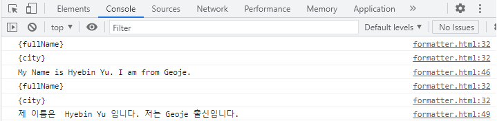

# 바닐라 자바스크립트 By 고승원

> 라이브러리 직접 구현해보기 
> 
> 다국어를 적용하는 라이브러리
> 
> i18n은 internationalization(국제화)의 첫문자인 i와 마지막 문자인 n 사이에 18개의 문자가 있어
> 이를 줄여서 i18n으로 표현

  ## 주목할 함수

##  1. document.querySelectorAll("[태그내 속성이름]");
    - 태그 내 특정 속성을 가지고 있는 모든 HTML요소를 찾아 반환한다.

~~~Java Script
<body> 
 <h1 data-i18n="Order List"></h1>
 <button data-i18n="Search"></button>
 
</body>
~~~

##  2. 정규 표현식(Regular Expression) || 정규식
    - 정규 표현식은 문자열에 포함된 특정 문자 조합을 찾기위해 사용되는 패턴이다.
    - 복잡한 프로그램 코드를 간략하게 작성할 수 있다는 장점이 있지만 가독성이 떨어지고 코드구현이 쉽지 않다.
    - 하지만 정규 표현식을 사용하면 굉장히 어려운 프로그램도 쉽게 해결할수 있기때문에 굉장히 유용하다.
    - 실무에서 정규 표현식을 가장 많이 사용하는 사례 
    1) 사용자가 입력한 이메일정보가 이메일 형식에 맞는지
    2) 전화번호가 전화번호 형식에 맞는지 등
    => 사용자로부터 입력받은 데이터가 프로그램에서 받고자 하는 데이터 형식과
       일치하는지 체크할 때 쓰인다.
    
    정규식을 만드는 방법은 두 가지가 있다.
    1. 슬래시(/)로 감싸는 패턴인 정규식 리터럴을 사용하는 방법
    - const regExp = /World/; 문자열에서 World와 똑같은 문자열이 있는지 찾는다
    2. Regexp 객체의 생성자 함수를 사용하는 방법
    - 생성자 함수를 사용하면 정규식이 실행 시점에 컴파일이 된다. 정규식 패턴이 변경될 수 있거나, 사용자 입력이나
      데이터베이스등 다른 출처로부터 오는 정보에 따라 정규식 패턴으로 동적으로 적용해야 하는 경우는 생성자 함수
      를 사용하면 된다.( 이 부분은 다음번에 공부해보도록 하고 이번에는 첫번째 방법만 공부할 것이다.)
    - 예제: regexp = new RegExp("World");
      
##  2-1. 정규식 함수(아래의 예시에 나오는 함수만 공부함)
      
함수 | 동작
------ | ---
exec | 정규식을 통해 찾고자 하는 문자열 패턴을 찾고 배열을 반환한다. 대응되는 문자열을 찾지 못하면 null 을 반환
match | 대응되는 문자열을 찾아 배열로 반환하는 String 객체 내장 함수. 대응되는 문자열을 찾지 못하면 null을 반환(exec과 동일한 기능)
replace | 대응되는 문자열을 찾아 다른 문자열로 치환하는 String 객체 내장 함수.
      
      

 

##  2-2. 정규식 특수문자(아래의 예시에 나오는 함수만 공부함)

    - 정규식은 /World/같이 정규식 패턴에 사용하는 문자가 단순 문자로 구성될 수도 있지만, 정규식에서 사용할 수 있는
      특수문자를 잘 조합해서 사용하면 훨씬 복잡한 문자열 패턴을 찾을수 있다.
    - 이번 코드에서 가장 중요했던 코드(아래)
        
~~~Java Script
    function t(form, params = {}){
        return form.replace(/{[^}]*}/g, match =>{ // replace 함수 내에서 2번 반복으로 문자열 변경함
            // console.log(match);
        return params[match.slice(1, -1)];  // 문자열을 둘러싼 { }을 제거. 
~~~
    - 함수 t는 form과 params( ={}는 객체를 매개변수로 받는다는 의미)을 매개변수로 받는다.
    - form.replace함수는 정규식 패턴조건을 만족하는 문자열을 form 에서 찾아 두번째 인자인 함수의 결과물로 대체한다.
    - match는 정규식을 부합하는 문자열을 받는 변수이다.
    - console.log(match)했을 때 작업창에 나오는 결과물은 아래와 같다.

    - 즉 match변수는 정규식 조건에 부합하는 값을 2번 받아 함수내로 전달한다. $1 = {fullName}, $2 = {city}
    - 결과: 매개변수로 받은 params 객체에서 match.slice(1,-1), 즉, {}를 제외한 문자열만 추출하여 params객체의
      키의 값을 전달받아 정규식의 조건을 만족하는 문자열을 대체한다. 
      
    
##  2-3. 조건식의 의미

    - 조건식 /{[^}]*}/g 을 설명하겠다.
    => 문자열은 { }을 포함하고, 또한 {  } 내부 문자열은 }을 포함하지 않고 그외 문자를 0회 이상 반복(문자가 0개 이상, 있어도 되고 없어도 되고)
    => 즉, 위의 해석을 부합하는 것은 {fullName}과 {city} 이다.
    
정규표현식 | 의미
------ | ---
/정규표현식/ | 슬래시로 패턴인 정규식 리터럴을 사용함을 의미
{ } | 문자열이 { } 을 포함함
/[a-d]|문자셋, 하이픈(-)을 사용하여 문자의 범위를 지정할 수 있다. 예를 들어 [a-d]는 문자열에 "a", "b", "c", "d"중 하나라도 있다면 대응된다.예)"red" "d" 에 대음됨
/[^a-d] | 부정문자셋, 패턴에 포함된 문자가 없는지와 대응된다. 하이픈을 사용하여 문자의 범위 지정 가능. [^a-d]는 문자열에 "a", "b", "c", "d" 모두 없는지와 대응
"*"| 특수문자 * 앞의 표현식이 0회 이상 반복되는 부분과 대응된다.{0,} 과 같은 의미. 예를 들어, /bo*/는 자열에 "b"를 포함하고 "b"다음 문자로 "o"가 0회 이상, 즉 "o"가 없을 수도 있고, 있을수도 있다는 의미. 문자열 "boom"의 "b"는 대응되고, "A bird"도 대응되지만 "A goat"는 대응되지 않는다.
g | 전역검색, 대응되는 문자 모두 검색한다는 뜻

    
~~~Java Script
    <body>
  
 <h1 data-i18n="Order List"></h1>
 <button data-i18n="Search"></button>

 
</body>
~~~

