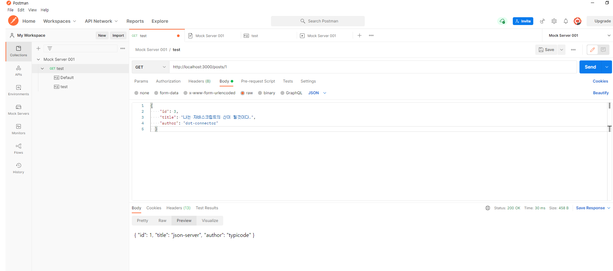

# 바닐라 자바스크립트 By 고승원

> 챕터 6.2에서는 JSON서버를 활용하여 CRUD테스트를 함.
> 
> Mock Server
>
> GUI기반의 Tool인 Postman을 이용해 Mock서버를 설치해서 좀 더 직관적인 방법으로 API를 등록하고 사용하기
-----

##  1. Mock 서버란?
    + 실제 서버처럼 클라이언트로부터 요청을 받고 응답을 주는 가짜서버
    + 실제 프로젝트에서는 모든 데이터를 서버로부터 받아오기때문에 가짜서버인 Mock서버를 준비함으로써, 
      실제처럼 API를 호출해 데이터를 받아와서 사용
    
##  2. Postman(API개발을 위한 협업 플랫폼)
    + 개발된 API를 테스트, 모니터링, 공유하여 API개발의 생산성을 높여준다.
    + Postman에서 제공하는 아주 유용한 기능 중의 하나가 바로 Mock 서버이다.
    + 실제로 사용해보니, 코드로 하나씩 적어야 했던 것을 GUI로 직관적으로 사용 가능하다. 
+ PUT 하기 위해 아래와 같이 코드를 적어야 했던 것을 
 ~~~Java Script
 
  fetch("http://localhost:3000/posts/2", {
            method: "PUT",
            body: JSON.stringify({
                // 전송할 데이터
                id:2,
                title: "The Su Hyebin",
                author: "Hyebin",

            }),
            headers: { 
                //헤더값 정의
                "content-type": "application/json; charset=UTF-8" // content-type 정의
            },           
        })
        .then((response) => response.json())
        .then((json) => console.log(json));
~~~
+ 아래의 사진처럼 GUI로 직관적으로 처리할 수 있으니 편리한게 당연하듯 하다

+ 말보다는 직접 눈으로 보는게 낫다. 아래의 동영상 참조
+ 참조: 유튜버 우리밋_woorimIT 동영상 [서버 API 테스트 도구 | Postman | curl](https://www.youtube.com/watch?v=0veQoK9V07k)
+ 참조: 개발자 https://poiemaweb.com/님 [Json Server](https://poiemaweb.com/json-server#:~:text=json%2Dserver%EB%8A%94%20json%20%ED%8C%8C%EC%9D%BC,%ED%95%A0%20%EC%88%98%20%EC%9E%88%EB%8A%94%20%ED%88%B4%EC%9D%B4%EB%8B%A4.)
